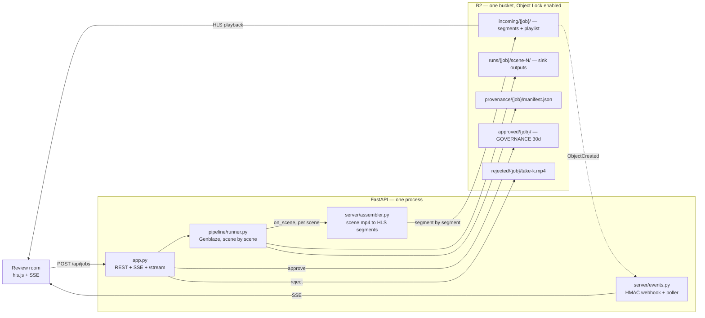

# FirstFrame

**A review room for generative video that shows you the first frame while the rest is
still rendering.** Built for the small studio that ships 40 AI-generated product spots a
week and rejects about a third of them. Today the reviewer waits for the whole render to
finish before discovering that the shot was wrong at second three — FirstFrame puts frame
one on screen in seconds and keeps generating behind it.

Backblaze Generative Media Hackathon · Genblaze 0.4.5 + Backblaze B2.

---

## The number

The pipeline is sequential — Genblaze's `batch_run` is always sequential and
`abatch_run(max_concurrency=0)` deadlocks, so there is no concurrency to win here. The
win is architectural: each scene is segmented and published to B2 the moment it exists,
so playback starts on scene 1 instead of on scene N.

| | measured |
|---|---|
| **First frame on screen** | **5.4 s** |
| **Full render** | **22.8 s** |
| **Gap** | **4.2×** |

Job `j_23a692`, 3 scenes, recorded by the app itself in `data/firstframe.db`
(`first_frame_ms=5375`, `total_render_ms=22795`). Across the six runs of the real
pipeline still in that database, the first frame lands between **5.4 s and 10.9 s**
against **22.8 s to 36.5 s** of full render — a 2.5× to 4.5× gap. Those runs used
`DEMO_MODE=mock` with the vision judge off (`JUDGE_THRESHOLD=0`); see
[Honest limitations](#honest-limitations). The gap is a property of the architecture, not
of the provider: with real providers both numbers grow and the ratio grows with them,
because the denominator is "all N scenes" and the numerator is always "one segment".

The clock is not a decoration in the UI. `first_frame_ms` stops when the first segment of
**real content** is servable — the LIVE slate at `scene: 0` is explicitly excluded
([`server/assembler.py#L265-L273`](server/assembler.py#L265-L273)).

---

## Architecture

Full diagrams, the scene DAG and the event plane: [`docs/architecture.md`](docs/architecture.md).



---

## How we use Backblaze B2

B2 is not a bucket we drop finished files into. It is the delivery surface, the
audit surface and the tenancy boundary. Every claim below links to the line that does it.

### The key layout is the data architecture

[`infra/b2_setup.py#L121-L130`](infra/b2_setup.py#L121-L130) ·
[`pipeline/manifest.py#L49-L58`](pipeline/manifest.py#L49-L58) ·
[`server/assembler.py#L67-L73`](server/assembler.py#L67-L73)

```
refs/{job}/                       source assets, documented with Pipeline.ingest
incoming/{job}/seg/00001.ts       HLS segments, uploaded as ffmpeg closes them
incoming/{job}/index.m3u8         playlist, rewritten after every segment
runs/{job}/scene-{n}/             Genblaze ObjectStorageSink outputs
provenance/{job}/manifest.json    aggregated job manifest — as an OBJECT, never metadata
approved/{job}/final.mp4          master + embedded manifest + GOVERNANCE 30d
approved/{job}/manifest.json      written by the sink with manifest_lock=ObjectLockConfig
rejected/{job}/take-{k}.mp4       discarded takes: the evidence of the refine loop
```

Why one prefix per concern and not a flat bucket: B2 rejects two event-notification rules
that share an event type with *overlapping* prefixes, application keys are scoped by
prefix, and lifecycle rules are scoped by prefix. Choosing the prefixes badly means you
cannot express the policy at all. We validate the overlap rule locally before calling the
API so a design mistake shows up as a readable error instead of an opaque 400
([`infra/b2_setup.py#L298-L314`](infra/b2_setup.py#L298-L314)).

A second consequence, easy to miss: **a bucket with Object Lock enabled drops the
name + file-info limit from 7000 to 2048 bytes.** A 3-scene Genblaze manifest is far
bigger than that, so the manifest is always the object *body*, never `Metadata=`
([`pipeline/manifest.py#L260-L287`](pipeline/manifest.py#L260-L287)).

### Object Lock GOVERNANCE on manifests and on the approved master

[`pipeline/manifest.py#L131-L135`](pipeline/manifest.py#L131-L135) ·
[`pipeline/manifest.py#L387-L429`](pipeline/manifest.py#L387-L429) ·
[`server/jobs.py#L481-L514`](server/jobs.py#L481-L514) ·
[`server/b2.py#L204-L212`](server/b2.py#L204-L212)

Approve does three things. It embeds the Genblaze manifest inside the MP4, it uploads the
master with `ObjectLockMode="GOVERNANCE"` and `ObjectLockRetainUntilDate=now+30d`, and it
writes the approved manifest through an `ObjectStorageSink` constructed with
**`manifest_lock=ObjectLockConfig(mode="GOVERNANCE", retain_until=...)`**
([`pipeline/manifest.py#L412-L413`](pipeline/manifest.py#L412-L413)) — the SDK parameter
that hands provenance records to B2 as WORM. No example in the SDK uses it.

The proof is in the self-check, not in prose: `pipeline/manifest.py` `demo()` uploads,
reads the retention back, then tries to delete the locked version and asserts that B2
refuses ([`pipeline/manifest.py#L681-L688`](pipeline/manifest.py#L681-L688)).
`server/b2.py` `demo()` does the same and prints the `AccessDenied`
([`server/b2.py#L427-L438`](server/b2.py#L427-L438)).

### Native versioning, and the subtlety that makes the lock real

[`server/b2.py#L297-L312`](server/b2.py#L297-L312)

`delete_object` **without** a `VersionId` only writes a hide marker, and Object Lock does
not stop that — the version underneath is still there. To show that retention actually
protects the bytes you have to delete the specific version, and *that* is what B2 rejects.
We use B2's native versioning (`VersionId` off the `HEAD`) both for the demo and for the
`bypassGovernance` cleanup path. This is the difference between a screenshot that looks
like Object Lock working and Object Lock actually working.

### Four lifecycle rules, including the one nobody uses

[`infra/b2_setup.py#L47-L79`](infra/b2_setup.py#L47-L79) ·
applied and re-read for verification at
[`infra/b2_setup.py#L340-L399`](infra/b2_setup.py#L340-L399)

| # | Prefix | Rule | What it solves |
|---|---|---|---|
| 1 | `incoming/` | **`daysFromStartingToCancelingUnfinishedLargeFiles: 1`** | a video job that dies mid-render leaves an orphan multipart upload whose uploaded parts keep occupying and keep billing. B2 cancels it in 24 h. Zero cron, zero cleanup, zero silent cost leak. |
| 2 | `rejected/` | hide 1d, delete 7d later | rejected takes are evidence, not archive |
| 3 | `runs/` | hide 3d, delete 7d later | Genblaze intermediates |
| 4 | `approved/` | hide-to-delete **1d** | aggressive purge of hidden versions |

Rules 1 and 4 are the ones that show the system was understood.

Rule 1 is the failure mode specific to generative *video*: renders die, and an aborted
multipart upload is the mess nobody cleans and everybody pays for.

Rule 4 exists to be in tension with the retention on the same objects. A 1-day
hide-to-delete rule pointed at `approved/`, and a 30-day GOVERNANCE retention on the
masters in `approved/`. **Retention wins.** The result is exactly what a studio wants:
junk and hidden versions get purged hard, while the master delivered to the client is
untouchable for 30 days — not by us, not by a badly written rule, not by a leaked key.

The script is idempotent and it does not trust the API's own response: it re-reads the
bucket after writing and compares, and exits 1 if the read-back does not match
([`infra/b2_setup.py#L356-L365`](infra/b2_setup.py#L356-L365)).

### Restricted application keys — multi-tenancy at the storage layer

[`infra/make_keys.py#L50-L77`](infra/make_keys.py#L50-L77) ·
verification against the live API at
[`infra/make_keys.py#L94-L155`](infra/make_keys.py#L94-L155)

Two keys, both scoped to this bucket:

| Key | Capabilities | Prefix |
|---|---|---|
| `firstframe-server` | 20 caps, no `writeBuckets`, no `deleteBuckets`, no `writeKeys` | whole bucket |
| `firstframe-reviewer` | **`readFiles` only** | **`approved/`** |

The client's external reviewer does not get an application-layer `if user.role ==
"reviewer"`. They get a Backblaze key that physically cannot write, cannot delete, cannot
even *list* the bucket, and cannot see a single byte outside `approved/`. There is no code
of ours in the authorization path that could have a bug in it.

`make_keys.py` does not take our word for it. For every key it creates, it authorizes
with the new key and compares capabilities / bucketId / namePrefix against what was
requested, then asserts the negatives against the live API: `b2_get_upload_url` must come
back **401**, and an S3 `list_objects_v2` must come back **403 AccessDenied**. If any check
fails, the script exits 1.

Note that the server key deliberately lacks `writeKeys` — `make_keys.py` is a bootstrap
script that runs with the master key and then steps aside
([`infra/make_keys.py#L177-L203`](infra/make_keys.py#L177-L203)).

### HLS served out of the bucket, segment by segment

[`server/assembler.py#L208-L293`](server/assembler.py#L208-L293) ·
[`server/assembler.py#L174-L205`](server/assembler.py#L174-L205) ·
[`server/streamer.py#L71-L149`](server/streamer.py#L71-L149)

This is the piece the product stands on. Each finished scene mp4 goes through ffmpeg with
identical encode parameters and is segmented into ~2 s `.ts` chunks. Segments are uploaded
to `incoming/{job}/seg/` **as ffmpeg closes them**, not at the end, and
`incoming/{job}/index.m3u8` is regenerated after each one, carrying
`#EXT-X-PLAYLIST-TYPE:EVENT` while the job lives and `#EXT-X-ENDLIST` when it closes.
(The playlist a player sees is regenerated from the database on every request; the copy
pushed to B2 is throttled to at most one upload every `B2_PLAYLIST_UPLOAD_EVERY_S` — 5 s by
default — and always on close, because the durable artifact does not need a write per
segment.)
Because each scene is an independent encode whose PTS restarts at zero, the playlist emits
`#EXT-X-DISCONTINUITY` at every scene boundary — without it the player stalls.

Three things we learned the hard way, all verified in Chrome with hls.js 1.5 and all
encoded in the code:

- A **404** on the first playlist request makes hls.js raise a fatal `manifestLoadError`
  and it never retries. An empty-but-valid EVENT playlist raises `levelEmptyError`, same
  outcome. So the server publishes a 2-second "LIVE" slate the instant the job is created
  ([`server/assembler.py#L296-L337`](server/assembler.py#L296-L337)) **and** holds the
  first `m3u8` request for up to 6 s waiting for segment one
  ([`server/streamer.py#L71-L112`](server/streamer.py#L71-L112)).
- Segments are requested while they are still landing, so the segment endpoint retries
  internally for ~2 s instead of answering 404.
- The player never talks to B2 directly. The bucket is private; browser access to a
  private B2 bucket needs signed URLs, and hls.js will not sign anything.

**One honest detail about serving.** Segments are written to local disk *and* uploaded to
B2. Playback reads local disk first and falls back to B2
([`server/streamer.py#L115-L149`](server/streamer.py#L115-L149)) — because serving every
segment from B2 costs one Class B transaction per segment *per viewer*, and that is
precisely what exhausted this free account's daily transaction cap during integration.
B2 remains the durable store for every segment and playlist, and it is what the reviewer
downloads from. See [Transaction budget](#we-blew-the-free-tier-transaction-cap-once) below.

### Presigned URLs, AWS4 path-style

[`server/b2.py#L349-L360`](server/b2.py#L349-L360) ·
endpoint at [`server/app.py#L269-L279`](server/app.py#L269-L279)

Virtual-host-style presigns (`https://bucket.s3.<region>.backblazeb2.com/key`) fail in the
browser against private B2 buckets. The fix is undocumented: force
`Config(s3={"addressing_style": "path"})` so the URL is
`https://s3.<region>.backblazeb2.com/<bucket>/<key>`. `presign_path_style()` asserts the
shape of the URL it produces, and `server/b2.py` `demo()` actually fetches the presigned
URL over plain HTTP with no credentials and checks the body
([`server/b2.py#L407-L419`](server/b2.py#L407-L419)).

### Event Notifications with HMAC-SHA256, and a poller that covers for them

[`infra/b2_setup.py#L85-L116`](infra/b2_setup.py#L85-L116) (5 rules) ·
[`server/events.py#L71-L87`](server/events.py#L71-L87) (signature) ·
[`server/events.py#L131-L155`](server/events.py#L131-L155) (ack + dedupe) ·
[`server/events.py#L225-L299`](server/events.py#L225-L299) (poller)

Five rules on the bucket, under the 25-rule limit, with no overlapping prefixes inside an
event type: `segment-landed`, `render-complete`, `asset-approved`, `manifest-written`, and
`cleanup-audit` on `b2:HideMarkerCreated:LifecycleRule` — the last one turns a lifecycle
rule *acting* into a live audit feed.

`POST /webhooks/b2` verifies HMAC-SHA256 of the **raw body** against
`X-Bz-Event-Notification-Signature: v1=<64 hex>` in constant time, does
`INSERT OR IGNORE INTO events(event_id)` — B2 delivers at-least-once — enqueues, and
returns, because B2 requires a 200 in under 3 s. A worker thread does the real work.
`server/events.py` `demo()` rejects six classes of bad signature and verifies 200 webhooks
in well under the 3 s budget.

**This account has the Event Notifications API gated** (B2 answers
`400 ... not enabled`). `infra/b2_setup.py` detects that specific failure, prints
`WARN: event notifications gated -> EVENTS_MODE=poll`, keeps the rules declared and exits
green ([`infra/b2_setup.py#L450-L463`](infra/b2_setup.py#L450-L463)). The poller emits the
*same internal events*, so `EVENTS_MODE=webhook|poll|both|off` is a one-variable switch and
nothing downstream knows the difference. The day B2 enables the API for this account, the
rules are already written.

### We blew the free-tier transaction cap once

[`server/b2.py#L43-L130`](server/b2.py#L43-L130) ·
[`server/events.py#L225-L299`](server/events.py#L225-L299) ·
[`server/jobs.py#L644-L678`](server/jobs.py#L644-L678)

Worth saying because it changed the design. The first poller listed four prefixes every
2 s: 120 Class C calls a minute. We ate the account's daily cap in one afternoon of
integration and B2 started answering `AccessDenied: Transaction cap exceeded` on
`ListObjectsV2` and `HeadObject`, which took the whole app down.

What the code does now:

- every B2 call goes through one `_call()` wrapper that **counts** it by operation,
  detects the cap, and stops calling for a cooldown window instead of hammering the wall;
- repeated reads (`head`, retention, listings) are memoised with a TTL;
- the poller does **one prefix per tick**, rotating, with an adaptive interval — 10 s while
  a job is alive, 60 s idle, and scoped to `incoming/{job}/` rather than all of `incoming/`.
  From 3600 listings/hour to ~110 idle;
- an approve that hits the cap leaves the master locally and marks the job unlocked; a
  retry thread uploads it and applies the Object Lock when the quota returns, with nobody
  re-approving anything;
- `/api/health` reports the running transaction count, by operation, plus cap state.

The whole app degrades to local disk with the cap on, which `server/b2.py` `demo()`
asserts under a simulated cap ([`server/b2.py#L443-L468`](server/b2.py#L443-L468)).

---

## How we use Genblaze

### AgentLoop + ThresholdEvaluator with a real vision judge

[`pipeline/scenes.py#L537-L571`](pipeline/scenes.py#L537-L571) ·
[`pipeline/judge.py#L221-L271`](pipeline/judge.py#L221-L271) ·
[`pipeline/judge.py#L128-L152`](pipeline/judge.py#L128-L152)

The scene is wrapped in an `AgentLoop` whose `ThresholdEvaluator` has a `score_fn` that
calls `meta/llama-3.2-90b-vision-instruct` on NVIDIA NIM with the actual keyframe and the
brief, and returns 0..1. The SDK's only `AgentLoop` example uses mocks; this one looks at
pixels. On a fail, the judge's stated reason is injected into the next iteration's keyframe
prompt through `feedback_fn` ([`pipeline/scenes.py#L422-L438`](pipeline/scenes.py#L422-L438)),
and `AgentLoop` chains the iterations by `parent_run_id`.

Two things about that judge are verified facts, not preferences
([`VALIDACION.md`](VALIDACION.md)): the content must be the OpenAI-style array with
`{"type":"image_url","image_url":{"url":"data:image/png;base64,..."}}` — the inline
`` style returns *wrong answers* (a pure red PNG described as "orange",
then "grey") — and `nemotron-nano-12b-v2-vl` fails even with the correct format. The
`demo()` in `pipeline/judge.py` asserts the model can actually see a red frame before
trusting any score ([`pipeline/judge.py#L326-L347`](pipeline/judge.py#L326-L347)).

The judge degrades instead of exploding: no key, a timeout, or unparseable output yields a
neutral score flagged `degraded=True`, and the pipeline never dies because of it
([`pipeline/judge.py#L178-L209`](pipeline/judge.py#L178-L209)).

### A real fan-in: `input_from=[1, 2]` into `FFmpegCompositor`

[`pipeline/scenes.py#L524-L533`](pipeline/scenes.py#L524-L533)

Step 3 takes the voiceover (step 1) and the clip (step 2) in the same
`step.inputs`. That is a DAG, not a chain — and it is not decorative: `FFmpegCompositor`
refuses to run unless it receives both an `audio/` and a `video/` asset, and `input_from`
is the only way to hand it both. The self-check asserts the compositor's inputs were
exactly `{audio, video}` ([`pipeline/scenes.py#L655-L656`](pipeline/scenes.py#L655-L656)).
The composition step is also free — it is local ffmpeg.

### `fallback_models` with a failover you can trigger on camera

[`pipeline/scenes.py#L494`](pipeline/scenes.py#L494) ·
[`pipeline/scenes.py#L509-L523`](pipeline/scenes.py#L509-L523) ·
[`pipeline/providers.py#L185-L253`](pipeline/providers.py#L185-L253)

Keyframe: `flux.1-schnell` → `stable-diffusion-3-5-large-turbo`.
Clip: `pixverse-v5.6` → `seedance-2-0`.

Declaring `fallback_models` is cheap; demonstrating it is the criterion. So we verified
what actually triggers it: `Pipeline._try_fallback_models` only fires on
`ProviderErrorCode.MODEL_ERROR`. **A transport timeout does not trigger failover** — we
found that by hitting it. `ChaosWrapper` therefore raises a genuine `MODEL_ERROR` when a
provider is flagged dead, which is what `POST /api/chaos` (and the `k` key in the UI) does.

One detail worth the extra ten lines: `ChaosWrapper` kills only *guarded* models
(`guarded_models=["pixverse-v5.6"]`), not the fallback. Killing everything would leave the
pipeline with nowhere to go and there would be no failover to show. What the demo claims is
precisely what happens: the primary is down, the backup is not. The self-check asserts the
step ended on `seedance-2-0` with `fallback_from == "pixverse-v5.6"`
([`pipeline/scenes.py#L672-L681`](pipeline/scenes.py#L672-L681)).

`ChaosWrapper` also delegates through `inner.invoke()` rather than `inner.generate()`, so
the wrapped provider keeps its submit/poll/fetch cycle and retry policy, and it re-raises
preserving the real provider's `error_code` — a genuine `MODEL_ERROR` from the real
provider still triggers failover through the wrapper.

### Lineage by `parent_run_id`, at two levels

[`pipeline/scenes.py#L472-L474`](pipeline/scenes.py#L472-L474) ·
[`pipeline/runner.py#L504`](pipeline/runner.py#L504) ·
[`pipeline/manifest.py#L246-L252`](pipeline/manifest.py#L246-L252)

Scene N hangs off scene N-1 via `Pipeline.from_result(parent)`, and inside a scene the
`AgentLoop` chains its own iterations the same way. Since the SDK rewrites `parent_run_id`
when the loop refines, we keep the scene-to-scene edge separately as
`chain_parent_run_id` so the aggregate manifest can publish the whole tree instead of one
of its two axes. Rejecting a take also creates an edge: the refined run records
`rejected_run_id` ([`pipeline/runner.py#L663-L674`](pipeline/runner.py#L663-L674)), so the
manifest carries the bad-take → good-take chain.

Verified by assertion, not by hope:
[`pipeline/runner.py#L974-L978`](pipeline/runner.py#L974-L978).

### Manifest embedded in the MP4, and verification

[`pipeline/manifest.py#L350-L368`](pipeline/manifest.py#L350-L368) (embed) ·
[`pipeline/manifest.py#L489-L608`](pipeline/manifest.py#L489-L608) (verify) ·
[`server/jobs.py#L575-L625`](server/jobs.py#L575-L625) (the `/api/verify` path)

On approve, `SmartEmbedder`/`Mp4Handler` write the manifest into the MP4's uuid box, and we
immediately extract it again and compare canonical hashes — if it cannot be read back we do
not upload it as "verifiable" ([`pipeline/manifest.py#L360-L368`](pipeline/manifest.py#L360-L368)).

`verify(job)` is `genblaze verify final.mp4 --fetch`: it downloads the master from B2,
extracts the embedded manifest, checks the canonical hash, runs the manifest's own
`verification_report()`, and **re-downloads every declared asset to re-hash it**. It also
does the check that matters to a third party — that the master sitting in B2 right now is
byte-for-byte the one that was approved
([`pipeline/manifest.py#L596-L605`](pipeline/manifest.py#L596-L605)).

Note for whoever reproduces this: **genblaze 0.4.5 does not install a `genblaze` CLI**
(no `entry_points`). Our code uses the CLI when it is on `PATH` and otherwise runs the
identical checks in-process with the SDK, reporting which of the two ran in `method`.

### `ObjectStorageSink`, used correctly

[`pipeline/manifest.py#L122-L128`](pipeline/manifest.py#L122-L128) ·
[`pipeline/runner.py#L490-L502`](pipeline/runner.py#L490-L502)

A new sink per scene run, closed in a `finally` — it is single-use. The non-obvious part is
`_owns_sink=False`: `AgentLoop` passes the *same* `run_kwargs` to every iteration, so with
the default the sink would be closed after iteration 1 and iteration 2 would write into a
dead pool.

Two more sharp edges we hit and documented in place: the sink only reads `file://` paths
under `tempfile.gettempdir()` (`ALLOWED_FILE_ROOTS`) and never plumbs `output_dir`, so all
media work happens under temp ([`pipeline/runner.py#L323-L339`](pipeline/runner.py#L323-L339));
and the sink **rewrites `asset.url`** to the private B2 object during the run, so anything
that re-reads an asset afterwards — the judge, the runner, `verify` — has to sign the
request ([`pipeline/manifest.py#L443-L482`](pipeline/manifest.py#L443-L482)).

### `Pipeline.ingest` for provenance of things the pipeline did not generate

[`pipeline/manifest.py#L307-L332`](pipeline/manifest.py#L307-L332) ·
[`pipeline/manifest.py#L415-L424`](pipeline/manifest.py#L415-L424)

The approved master is assembled by ffmpeg from scene outputs, so no pipeline run produced
it. `Pipeline.ingest` is the SDK's answer for exactly that: the master gets a real Genblaze
manifest with its source, its sha256, the run ids of every scene it came from, and the key
of the aggregate manifest. And because that ingest run carries a sink with `manifest_lock`,
the manifest lands in B2 already WORM.

### Two providers of our own, and a third generation mode built out of them

`GEN_MODE=mock|free|real` ([`pipeline/scenes.py#L166-L192`](pipeline/scenes.py#L166-L192)).
`mock` is ffmpeg `testsrc2`, instant and offline. `real` is the paid connectors.
**`free` is real generation with no card and no API key at all** — and it exists because we
wrote the two providers it needs
([`pipeline/scenes.py#L332-L350`](pipeline/scenes.py#L332-L350)).

**`PollinationsProvider`** — [`pipeline/free_provider.py`](pipeline/free_provider.py),
end-to-end probe in [`scripts/probe_free_provider.py`](scripts/probe_free_provider.py).

We had no credentials for any image-generation provider — NIM's free tier gives chat and
vision but its `genai` image endpoint hangs. Rather than ship a demo made entirely of
`testsrc2`, we wrote a real `SyncProvider` against Pollinations.ai, the one image API that
answers 200 with **zero credentials**: no key, no signup, no card. It plugs into
`Pipeline.step()`, its assets go up through `ObjectStorageSink`, and its output passes
`Manifest.verify()` like any official connector.

It is a real provider, so it deals with real problems: a process-wide lock because the
anonymous tier queues one request per IP and a second concurrent request gets an instant
429; retries with backoff that honour `Retry-After`; magic-byte sniffing so a 200 that
isn't an image never reaches B2; real `sha256` and real dimensions read back off the file
rather than copied from the request (the anonymous tier silently caps resolution at
1024x576, so the `Asset` would otherwise lie); and an unknown model mapped deliberately to
`MODEL_ERROR`, because that is the only code `fallback_models` reacts to.

Measured honestly in its docstring: the anonymous tier takes **44.9 s min / 46.9 s mean /
52.8 s max** per image, and it is rate limiting rather than generation time — identical
latency at 512x288 and at 1024x576. So the scene pipeline wraps it in `CachedPollinations`
([`pipeline/scenes.py#L254-L320`](pipeline/scenes.py#L254-L320)) with a persistent
keyframe corpus keyed on prompt + seed + model + size
([`pipeline/scenes.py#L197-L252`](pipeline/scenes.py#L197-L252)) and a seed derived from
the prompt itself ([`pipeline/scenes.py#L322-L329`](pipeline/scenes.py#L322-L329)) — same
brief, same image, instantly; refined prompt, new image, which is exactly what refining
should mean. The SDK's own `StepCache` is not enough here because `runner.run_job`
namespaces it per job, so two jobs with the same brief would each pay the 45 s again.

That wrapper also had to work around a real SDK behaviour: `Pipeline` **pulls `seed` out of
`params`** and promotes it to `Step.seed`, so a provider reading `step.params["seed"]`
would never see it and every re-render would return a different image. `CachedPollinations`
re-injects it into `params` for the duration of the call and restores it on the way out,
because leaving it mutated would change the key `StepCache.put` computes.

**`KenBurnsProvider`** — [`pipeline/kenburns.py`](pipeline/kenburns.py)

`free` mode has real images but no free video model, so the image→video step needed
filling — the same slot `pixverse`/`seedance` occupies in `real` mode. A still image is not
a video: a slideshow reads on camera as exactly what it is. So the second provider turns a
keyframe into an actual shot with ffmpeg `zoompan`, and three things in it are the
difference between "looks generated" and "looks shot":

- **Supersample before `zoompan`.** Applied directly to the 1024x576 the anonymous tier
  returns, `zoompan` judders and goes soft. Pre-scaling to 3× the canonical size
  (3840x2160, lanczos) makes the motion subpixel and the 1280x720 output sharp. ~1 s per
  4 s clip — free next to the 45 s of the image.
- **Only `on`, never `zoom`.** The `z='min(zoom+0.0015,1.5)'` expression everyone copies is
  cumulative — it depends on the previous frame, so the move changes if `d` changes and it
  is not reproducible. Every expression here is written against `on`, the output frame
  index, so the shot is identical on every re-render.
- **Easing and per-scene direction.** Linear interpolation starts and stops abruptly and
  gives the automation away; a smoothstep on the progress does not. And `move_for(n)`
  rotates push-in / pan / pull-out / rise by scene index, so a 3-scene spot never repeats a
  move.

It emits a silent clip at the canonical parameters, so the voiceover is mixed in at step 3
by `FFmpegCompositor` exactly like in the mock and real paths. Self-check:
`.venv/bin/python -m pipeline.kenburns`, no network needed.

### `PassthroughProvider`, because `Pipeline.input(file)` does not exist

[`pipeline/providers.py#L160-L183`](pipeline/providers.py#L160-L183)

Step 0 must be a generating provider — there is no way to start a pipeline from an asset
that already exists. Ten lines fixes it, and 8 of 10 official sample apps hit this.
It is what [`scripts/probe_spine.py`](scripts/probe_spine.py) uses to exercise the whole
storage spine without spending a cent.

### Gotchas we hit, in code so nobody hits them twice

Everything here is written into the source as a comment at the line it matters:

- `Pipeline(..., preflight=False)` **always** — the default is `preflight=True` and it runs
  `validate_model()`, which is inverted (issue #248). A check that lies is worse than no
  check ([`pipeline/scenes.py#L464-L467`](pipeline/scenes.py#L464-L467)).
- `PromptTemplate(template=...)`, never positional — and templates must be `render()`ed
  before reaching `step()` outside `batch_run()`
  ([`pipeline/scenes.py#L95-L116`](pipeline/scenes.py#L95-L116)).
- Mocks from `genblaze_core`, never `genblaze_core.testing` (it imports pytest at module
  level, which is not a runtime dependency).
- No `@dataclass` on a `SyncProvider` subclass. It silently skips `BaseProvider.__init__`
  and blows up ~1300 lines away with `AttributeError: '_retry_policy_override'`.
- `.cache(StepCache(dir))` is fluent; `run(cache=...)` is a bare `TypeError`.
- No `Asset.text` — transcripts and JSON go in `metadata["text"]`
  ([`pipeline/scenes.py#L499-L507`](pipeline/scenes.py#L499-L507)).
- `genblaze-s3`'s preflight does a `HeadBucket` (Class B). With the transaction cap
  reached, that 403 is classified as a *permanent* error and poisons the backend for the
  whole process lifetime, killing runs before they generate anything — even though uploads
  (Class A) still work fine ([`pipeline/manifest.py#L91-L119`](pipeline/manifest.py#L91-L119)).

### Upstream contributions

We found these building with the SDK, so we fixed them:

| | |
|---|---|
| [PR #258](https://github.com/backblaze-labs/genblaze/pull/258) | `PromptTemplate("literal")` crashes — and the shipped `examples/batch_with_templates.py` dies on its own first line. Fixed with an `__init__` shim; 9 tests, 7 of which fail on `main`. |
| [PR #259](https://github.com/backblaze-labs/genblaze/pull/259) | `from genblaze_core.testing import MockProvider` raises `ModuleNotFoundError: pytest` on a clean install — and that line *is* the zero-API-key quickstart in `libs/core/README.md`. Fixed by making the pytest import lazy; 2 subprocess regression tests. |
| [PR #260](https://github.com/backblaze-labs/genblaze/pull/260) | Misplaced `run()` kwargs die with a bare `TypeError`. Now they name the call site that works, for 11 options across `run`/`arun`/`batch_run`/`abatch_run`; 20 tests + a config-location table generated from live signatures. |
| [Issue #261](https://github.com/backblaze-labs/genblaze/issues/261) | `@dataclass` on a provider subclass, with the double-`AttributeError` detail and three fix routes ranked. Filed as an issue rather than a PR because hard-failing at class definition is a maintainer's policy call. |

The full write-up, including the items we did not PR and why, is in
[`research/sdk-feedback.md`](research/sdk-feedback.md).

---

## Honest limitations

Short, because there is nothing dramatic here — but a judge with repo access deserves to
read it from us rather than find it.

**B2 Live Read is not available on this account.** It was the original architecture. We
probed it against the real account before building anything
([`scripts/probe_liveread.py`](scripts/probe_liveread.py)): with a multipart upload open
and part 1 of 5 MiB already uploaded, `GetObject` with `Range` returns **404 NoSuchKey**,
not the **416** the API defines when Live Read is active. Tested with the
`x-backblaze-live-read-enabled` header injected in `before-send` (outside the SigV4
signature) and in `before-sign` (inside it), across `CreateMultipartUpload`, `UploadPart`
and `GetObject`. It is a paid feature ($15/TB of marked upload capacity) and this is a free
account. So incremental HLS became the main architecture instead of the fallback — which,
in the end, is the more portable design. Details in [`VALIDACION.md`](VALIDACION.md).

**Event Notifications are gated at the account level.** B2 returns `400 ... not enabled`
when creating rules. The five rules are declared in `infra/b2_setup.py`, the signed webhook
receiver is written and tested (`server/events.py` `demo()`), and the poller emits the same
internal events, so `EVENTS_MODE=poll` is the effective mode. The webhook is credibility,
not a dependency.

**We have no paid media-generation credentials, so `mock` is the default mode.** The scene
pipeline runs the SDK's real `MockProvider`/`MockVideoProvider`/`MockAudioProvider` with an
`assets=` callable that synthesises genuine local media with ffmpeg, because their default
assets are `https://mock.test/...` URLs that ffmpeg cannot open and `FFmpegCompositor`
would fail on. Every step, sink, manifest, lock and verification in the pipeline is the
real thing; only the pixels are synthetic. `GEN_MODE=real` with
`NVIDIA_API_KEY` / `OPENAI_API_KEY` / `GMI_API_KEY` swaps each provider independently, and
a partial environment produces a `mixed` run instead of a crash
([`pipeline/scenes.py#L353-L419`](pipeline/scenes.py#L353-L419)).

**`GEN_MODE=free` is real generation with no credentials, and it is slow.** Pollinations'
anonymous tier serialises to one request per IP at ~45 s each, so a 3-scene spot is about
two and a half minutes of wall clock on a cold corpus — which is fine for the product
thesis (the first frame still arrives while the rest generates) but bad for a demo you have
to run twice. The keyframe corpus makes a re-run of the same brief instant, and
`--pregenerate` fills it ahead of time. The clip step in this mode is our Ken Burns
provider, not a video model: there is no free video generation, and the module says so in
its first paragraph rather than implying otherwise.

**The headline numbers come from mock-mode runs with the judge off.** 5.4 s / 22.8 s
was measured with `DEMO_MODE=mock` and `JUDGE_THRESHOLD=0`. The reason for the second one is
concrete: NIM's free-tier vision judge takes ~30 s per scene and, when it times out, it
degrades to 0.50 — below threshold — which triggers another iteration and another 30 s. With
the judge on, the first frame goes to ~70 s. So the judge is real and it is wired into a
real `AgentLoop`, and for a live demo it is switched off from the environment rather than
removed from the code ([`server/jobs.py#L259-L268`](server/jobs.py#L259-L268)).

**The live URL is not deployed yet.** `Dockerfile` and `fly.toml` are written and the
deployment commands are in the header of `fly.toml`. Run it locally with the commands
below; it needs no credentials.

**The UI is in Spanish.** The code, the API and this document are in English.

---

## Run it

### With no credentials at all

```bash
python3.13 -m venv .venv && .venv/bin/pip install -r requirements.txt
STUB=1 .venv/bin/uvicorn server.app:app --port 8000
# http://localhost:8000
```

`STUB=1` serves the whole review room off deterministic fake data — two preloaded jobs
(one `approved` with a lock badge, one `in_review`), a synthetic SSE stream, a manifest
panel and a verify button. No B2, no pipeline, no keys. Every response has the same shape
as the real one.

### The real thing, locally, still with no cloud credentials

Needs `ffmpeg` on `PATH`.

```bash
.venv/bin/uvicorn server.app:app --port 8000
```

`GEN_MODE=mock` (the default) and no `B2_*` variables means: the real Genblaze pipeline,
real `AgentLoop`, real fan-in, real manifests, real HLS assembly, everything served off
local disk. Paste a brief, press **New spot**, and watch the first-frame clock.
Press `k` for the chaos panel and kill `gmicloud` to see `fallback_models` fire.

### Real image generation, still with no credentials

```bash
# fill the keyframe corpus first — ~45 s per image on the anonymous tier
.venv/bin/python -m pipeline.runner --pregenerate

DEMO_MODE=free .venv/bin/uvicorn server.app:app --port 8000
```

Keyframes come from Pollinations.ai (no key, no card) and the clip step is our Ken Burns
provider. `DEMO_MODE` and not `GEN_MODE` for the server, because `server/jobs.py` forces
`mock=True` whenever `DEMO_MODE` is `mock`
([`server/jobs.py#L259-L260`](server/jobs.py#L259-L260)) — deploying in free mode is that
one variable and nothing else. Once the corpus is warm, re-running the same brief is
instant.

### Against your own B2 account

```bash
cp .env.example .env      # .env is gitignored; fill in the marked values

# 1. the bucket MUST be created with Object Lock — it cannot be enabled later
b2 bucket create <bucket> allPrivate --fileLockEnabled

set -a && . ./.env && set +a
.venv/bin/python infra/make_keys.py    # 2 restricted keys, verified against the live API
.venv/bin/python infra/b2_setup.py     # lifecycle + event rules, idempotent, re-reads to verify
.venv/bin/uvicorn server.app:app --port 8000
```

`.env.example` documents every variable, including which ones are optional and why.
`infra/b2_setup.py` is safe to run repeatedly; the second run should print
`sin cambios (idempotente)` for the lifecycle rules.

### The pipeline on its own

```bash
.venv/bin/python -m pipeline.runner --selftest                 # every module's demo()
.venv/bin/python -m pipeline.runner --job demo1 --mock --no-judge
.venv/bin/python -m pipeline.runner --job demo1 --mock --chaos gmicloud   # failover in the logs
.venv/bin/python -m pipeline.runner --job demo1 --mock --approve --verify
.venv/bin/python -m pipeline.runner --job demo1 --free          # real images, no credentials
.venv/bin/python -m pipeline.runner --pregenerate               # warm the keyframe corpus
```

### Every module self-checks

```bash
.venv/bin/python -m server.db          # schema + event_id idempotency
.venv/bin/python -m server.events      # HMAC (6 bad-signature classes) + 200 webhooks < 3 s
.venv/bin/python -m server.assembler   # 2 scenes -> growing playlist -> ENDLIST -> master
.venv/bin/python -m server.streamer    # ranges, path traversal, 404-retry, 0 B2 transactions
.venv/bin/python -m server.jobs        # end-to-end: create -> scenes -> approve -> lock -> verify
set -a && . ./.env && set +a
.venv/bin/python -m server.b2          # put/get/range/presign/lock + B2 refuses the delete
.venv/bin/python pipeline/free_provider.py   # generates a real image, no credentials needed
.venv/bin/python -m pipeline.kenburns  # still image -> moving shot, no network needed
```

---

## Providers and models

Three generation modes, selected with `GEN_MODE=mock|free|real`.

| Step | Mode | Provider | Model | Fallback |
|---|---|---|---|---|
| Keyframe | `real` | NVIDIA NIM | `black-forest-labs/flux.1-schnell` | `stabilityai/stable-diffusion-3-5-large-turbo` |
| Keyframe | **`free`** | **Pollinations.ai — our own `SyncProvider`** | `flux` nominal (`sana` is what the anonymous tier actually serves) | `turbo` |
| Keyframe | `mock` | Genblaze | `MockProvider` + ffmpeg | — |
| Voiceover | `real` | OpenAI | `tts-1` | — |
| Voiceover | `free`/`mock` | Genblaze | `MockAudioProvider` + ffmpeg | — |
| Clip | `real` | GMI Cloud | `pixverse-v5.6` | `seedance-2-0` |
| Clip | **`free`** | **our own `KenBurnsProvider`** | `kenburns-2.5d` | `kenburns-static` |
| Clip | `mock` | Genblaze | `MockVideoProvider` + ffmpeg | — |
| Composite | all | local ffmpeg | `FFmpegCompositor`, fan-in of steps 1 and 2 | — |
| Vision judge | all | NVIDIA NIM | `meta/llama-3.2-90b-vision-instruct` | — |
| Scene planning | optional | NVIDIA NIM | `meta/llama-3.3-70b-instruct` | fixed template |

Notes that matter: NIM's free tier serves chat and vision but **not** image generation
(verified — the `genai` endpoint hangs), which is why `free` mode exists at all. The vision
judge is free and verified working; `nemotron-nano-12b-v2-vl` gives wrong answers and is
not used. GMI Cloud is never used for audio — that modality is broken upstream (issue
#251). There is no free video-generation model anywhere, which is why the `free` clip step
is Ken Burns motion over a real generated still rather than a video model.

Storage: Backblaze B2, bucket `genblaze-review-migarci2`, region `eu-central-003`.
SDK: `genblaze` 0.4.5, `genblaze-core` 0.3.8, `genblaze-s3` 0.3.6.
Total cloud spend on generation for this project: **$0.00**.

---

## Repo map

```
pipeline/     Genblaze: scene DAG, vision judge, runner, manifests, chaos switch,
              and our two providers — free_provider.py (Pollinations) and kenburns.py
server/       FastAPI: jobs, B2 client, HLS assembler, streamer, event bus, sqlite
infra/        b2_setup.py (lifecycle + event rules), make_keys.py (restricted keys)
web/          review room — vanilla HTML/JS/CSS, no build step
scripts/      probes run against the real services before building on them
docs/         architecture.md
research/     competitive recon, SDK dossier, SDK feedback write-up
PLAN.md       the plan, with §0 = facts verified by running code
VALIDACION.md what we probed against the real services, and what came back
```
