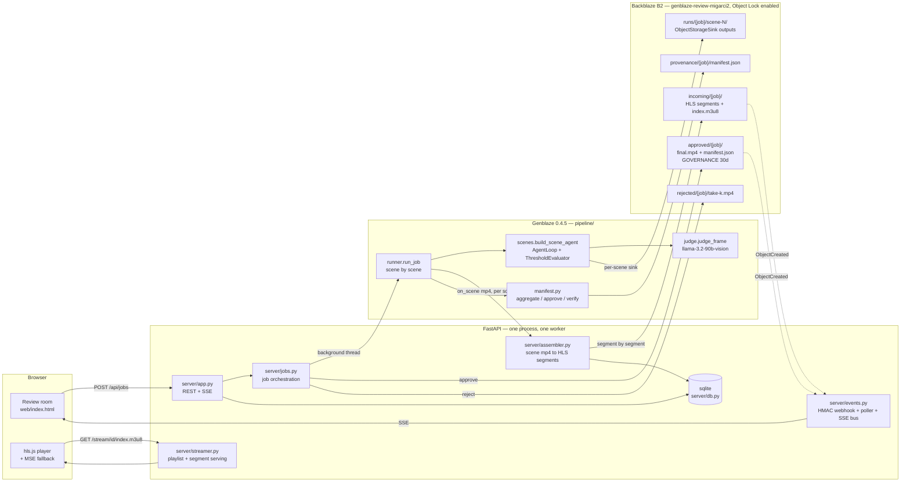
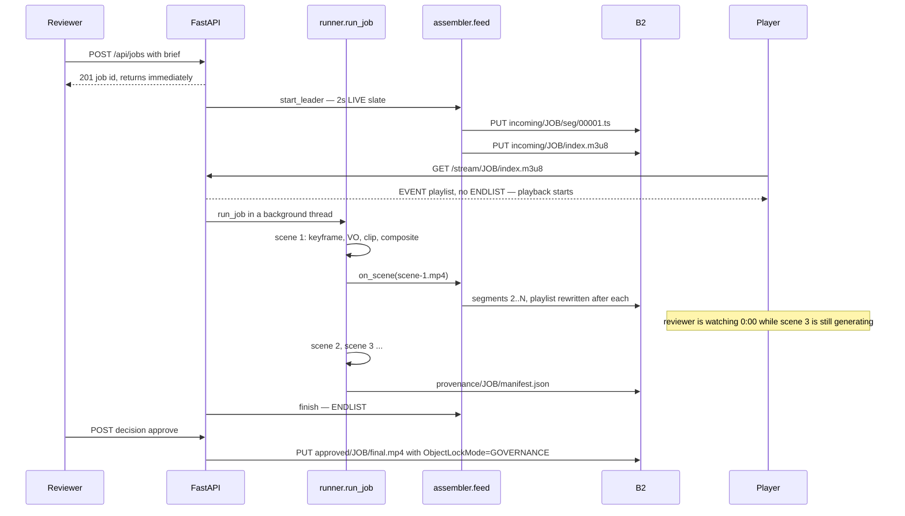
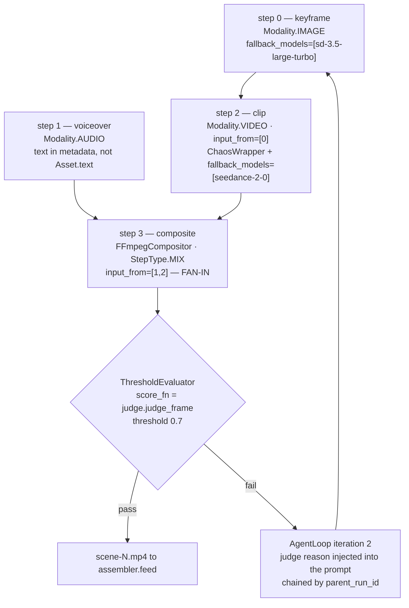
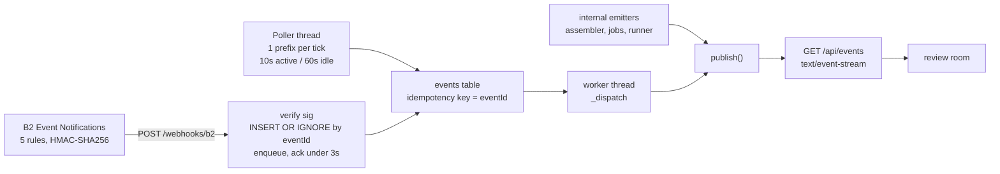

# FirstFrame — architecture

One FastAPI process, one B2 bucket, no queue, no external services. The whole
system exists to answer one question fast: **is this shot worth finishing?**

---

## 1. The system

Dotted arrows are B2 Event Notifications. They are declared on the bucket but the
API is gated on this account, so `server/events.py:Poller` produces the same
internal events from `list_objects_v2`. See the honesty section of the README.

---

## 2. The critical path: why the first frame arrives in seconds

Genblaze runs steps sequentially — `batch_run` is sequential and
`abatch_run(max_concurrency=0)` deadlocks, so there is no concurrency to win here.
The win comes from **not waiting for the last scene to start serving the first one**.

The floor on "first frame" is the HLS segment duration: a segment cannot be
published until it is closed. That is why `HLS_SEG_SECONDS` defaults to 2, not 4.

---

## 3. One scene as a Genblaze DAG

`input_from=[1,2]` is a real fan-in, not a formality: `FFmpegCompositor` refuses to
run unless `step.inputs` contains both an `audio/` and a `video/` asset, and that is
asserted in `pipeline/scenes.py` `demo()`.

---

## 4. Bucket layout

The key layout *is* the data architecture: B2 forbids overlapping prefixes inside the
same event type, application keys are scoped by prefix, and lifecycle rules are
scoped by prefix. One prefix per lifecycle policy, per key scope, per event rule.

| Prefix | What lives there | Lifecycle | Lock |
|---|---|---|---|
| `refs/{job}/` | source assets, documented with `Pipeline.ingest` | — | — |
| `incoming/{job}/seg/*.ts` | HLS segments, uploaded as they close | cancel unfinished large files after 1d | — |
| `incoming/{job}/index.m3u8` | playlist, rewritten after every segment | same | — |
| `runs/{job}/scene-N/` | Genblaze `ObjectStorageSink` outputs | hide 3d, delete 7d later | — |
| `provenance/{job}/manifest.json` | aggregated job manifest, as an **object** | — | — |
| `approved/{job}/final.mp4` | master with embedded manifest | hide-to-delete 1d | GOVERNANCE 30d |
| `approved/{job}/manifest.json` | written by the sink with `manifest_lock` | hide-to-delete 1d | GOVERNANCE 30d |
| `rejected/{job}/take-k.mp4` | discarded takes, the audit trail of the refine loop | hide 1d, delete 7d later | — |

The aggressive `approved/` rule and the 30-day retention on the same objects are not a
contradiction — that pair is the point. Retention wins over lifecycle in B2, so garbage
is purged hard while the delivered master is untouchable.

---

## 5. Event plane

`EVENTS_MODE=webhook|poll|both|off`. Because the idempotency key is the object, not the
source, running `both` is safe: whichever arrives second is a no-op.

---

## 6. Deployment

`python:3.13-slim` + ffmpeg, one uvicorn worker, one persistent machine
(`Dockerfile`, `fly.toml`). Not serverless, on purpose: the assembler uploads segments
while the pipeline is still generating, and the browser holds an SSE connection open for
the whole render. A 10-second function cannot do either. Region `ams` matches the
bucket's `eu-central-003`.
